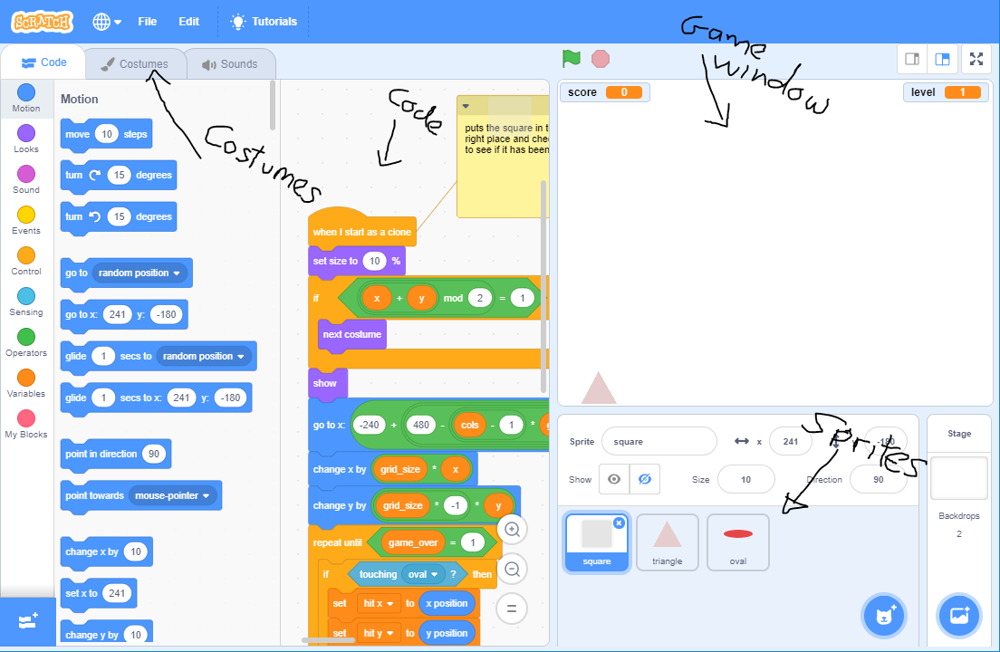
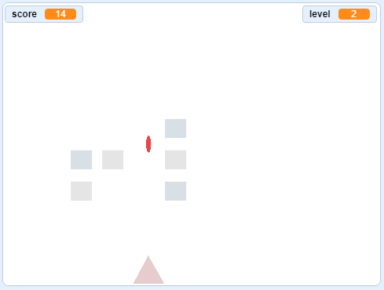
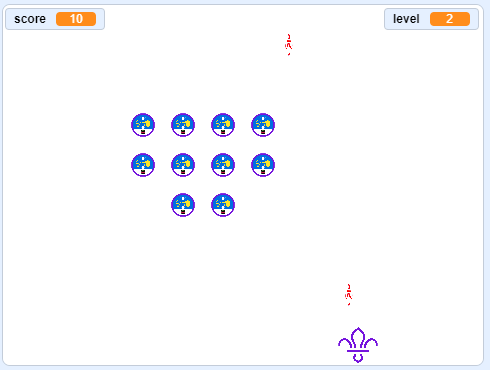
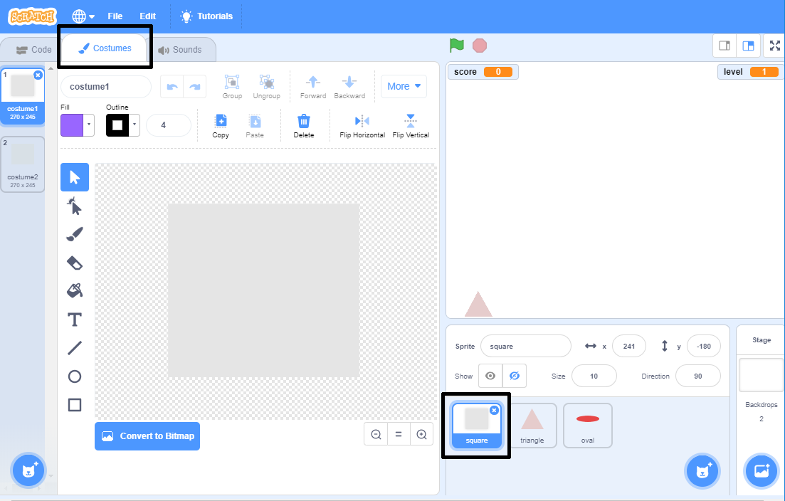
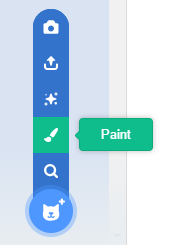
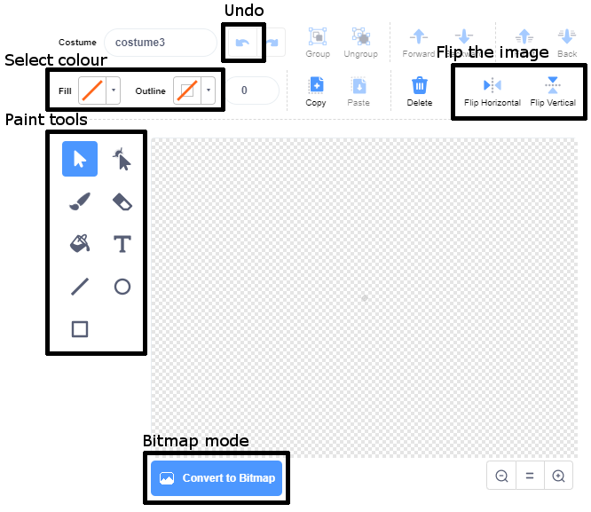
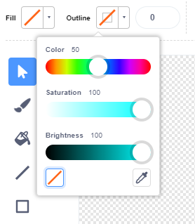
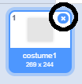
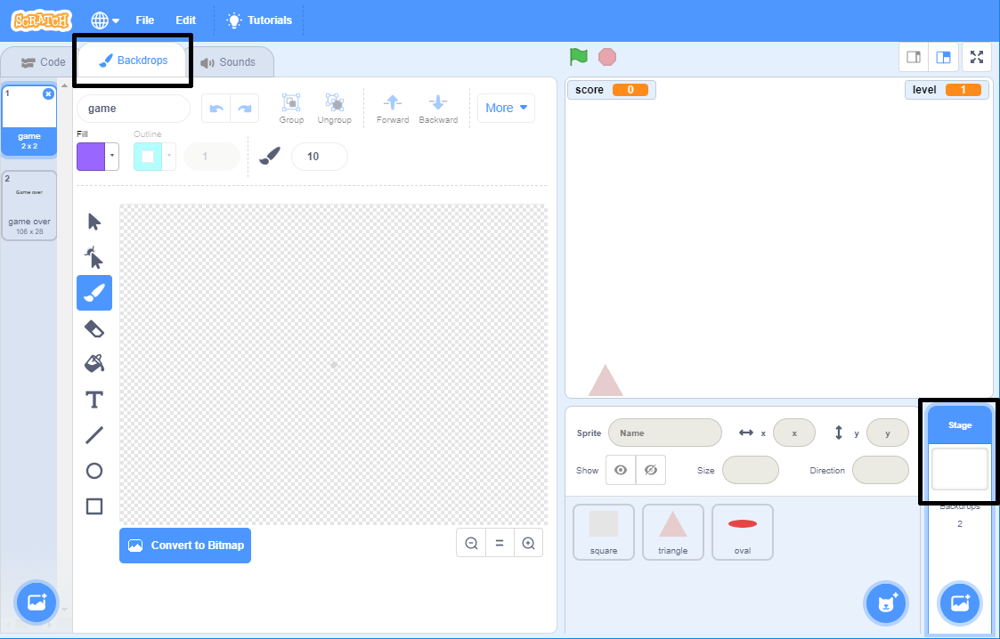
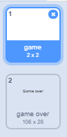

# Graphics for games

# Leader notes

## Overview

This activity fulfills Stage 3, Requirement 3 of the Digital Maker Staged Activity Badge (design and create digital graphics). 

Young people will design a theme and create the sprites and background for a computer game.

## Information 

+ Time - 45 minutes 
+ Group size - Flexible (ideally two young people per computer)
+ Preparation needed - If you’re running this activity without access to WiFi, you will need to download the software ahead of time. You may also wish to print handouts.
+ Location - Wherever you have access to computers

## You will need

+ Laptops, desktop computers or tablets
+ These can be shared between the group, recommend 1 per 2 young people
+ Activity handouts

### If your meeting place has WiFi

Run Scratch online in a web browser with an internet connection and open the starter project "shape shooter" using this link [rpf.io/scouts-graphics-on](http://rpf.io/scouts-game-design-on).

### If your meeting place doesn’t have WiFi

+ Download the Scratch Desktop application beforehand; refer to the Scratch guide [rpf.io/scouts-scratch](http://rpf.io/scouts-scratch) for instructions. 
+ Download the Scouts Game Design starter project "shape-shooter.sb3" from [rpf.io/scouts-graphics-go](http://rpf.io/scouts-graphics-go).

## Key messages

+ Creating a computer game is as much about art as it is about the programming.
+ The theme of a computer game comes from what it looks and sounds like not just do it does.

## Leader instructions
1. Discuss that computer games are not only created using code but also images.
2. Describe that image in a computer game is often known as a sprite.
3. If they haven't used it before introduce the young people to Scratch. Explain that it is a programming language for creating games, stories and animations.
4. Explain that they will be modifying a computer game by creating new sprites for it.
5. Demo the "shape shooter" game.
6. Explain that the sprites can be changed to anything they want.

## Alternatives

+ Create their own game and graphics.
+ Use more sophisticated image editing software such as Photoshop [photoshop.com](http://photoshop.com) or [GIMP](https://gimp.com) and upload costumes. 

## Safety

If the young people are working online, tell them to ask for permission before viewing any other websites. It’s a good idea to set up parental controls — you can find instructions for this on the NSPCC website [rpf.io/scouts-nspcc-online](http://rpf.io/scouts-nspcc-online).

You should also give each young person a Stay Safe leaflet [rpf.io/scouts-staysafe](http://rpf.io/scouts-staysafe).

## Adaptability

+ Take pictures of objects for the sprites and use the **Upload costume** option.

## Community and sharing

+ Ask the young people to showcase their new games and graphics. 
+ The games can also be shared on the Scratch website by logging in and using the **Share** option.

# Graphics for games

# Handout

In this activity you will be designing your own theme and graphics for a computer game called shape shooter.

## Instructions

### Part 1 - The game design

1. Open the "shape shooter" starter project in Scratch 3.

    **Online:** open the starter project at [rpf.io/scouts-graphics-on](http://rpf.io/scouts-graphics-on)

    **Offline:** click **File**, **Load from your computer** and select the `shape-shooter.sb3` file the leader has downloaded.

    

    You will see the shape shooter game, sprites, costumes and code in Scratch.

2. Click on the **green flag** to play the game.

    Shoot the squares with the ovals by using your mouse or touchscreen to control the triangle.

    

    As you can see at the moment the games graphics are really simple.

3. Think about or discuss with your group what theme you want the game to have. The choice is yours, it could be a scouts theme such as "badge collector" or something of your own creation like "Fairies vs dragons".

    

4. Decide on a background and what you are going to use instead of the **square**, **triangle** and **oval** sprites.

### Part 2 - Create your sprites

1. Select the square sprite and click on the costumes tab to open the editor.

    

2. Select **Choose a Costume** in the bottom left and click **Paint** to create a new costume.

    

3. Use the editor to create a new costume for the square sprite.

    

    The **paint tools** allow you to draw and changes the lines, shapes and text in your sprite.

    The **colour** can be changed using the colour selector for **fill** and **outline**. 

    A colour is chose by using the 3 values:
    + `color` - the colour you want
    + `saturation` - how much of the colour you want
    + `brightness` - how bright you want the colour to be

    

    **Bitmap** mode allows you to paint your costumes using pixels rather than lines and shapes.

4. The square sprite can have more than 1 costume and it will switch between them as the move across the screen.

    By creating more than 1 costume for the sprite, you can animate it so looks like it is moving across the screen. 

5. Delete any sprites you no longer need by clicking on the (x).

    

6. Play the game to see how your new sprite looks.

7. Create new costumes for your **triangle** and **oval** sprites.

### Part 3 - Create a backdrop

1. Your game should also have a background to compliment the game, select the **Stage** and click **Backdrops** to display the backdrops.

    

2. There are 2 backdrops, one used while the game is playing, one when its game over.

    

3. Create a new background for your game to complete the theme.

4. Share your completed game with your friends and see who can get the highest score.

## Did you know

Computer sprites are named after the mythical creatures because they *float* across the screen.

## Discuss

How do you think the game could be modified to make it more fun or to fit your theme better?

## Tip

When creating multiple costumes, use **duplicate** to create a copy and modify it rather than having to redraw.